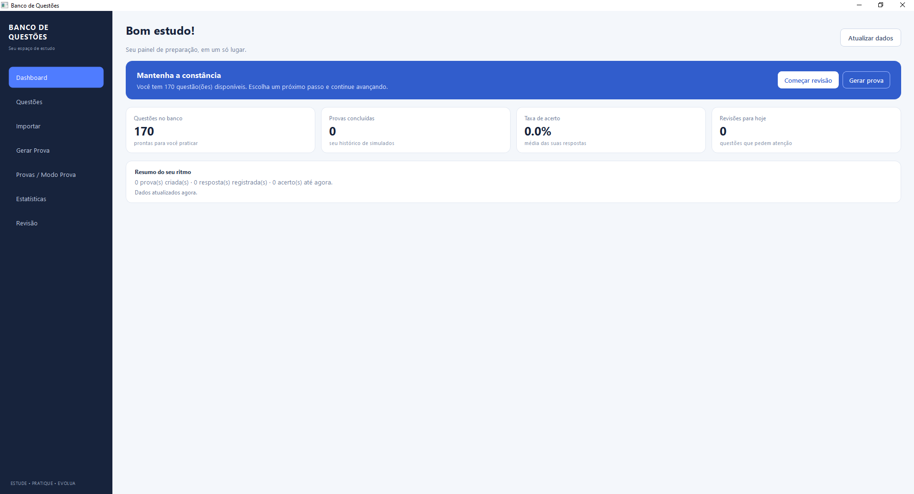
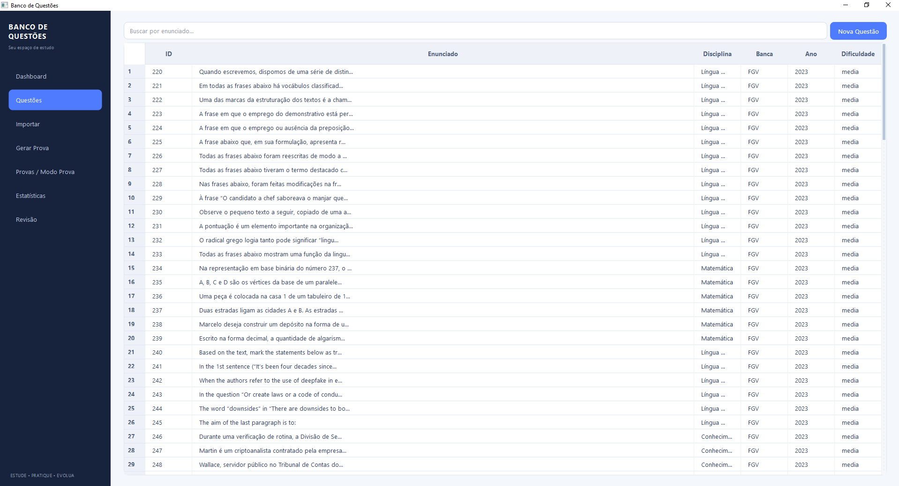
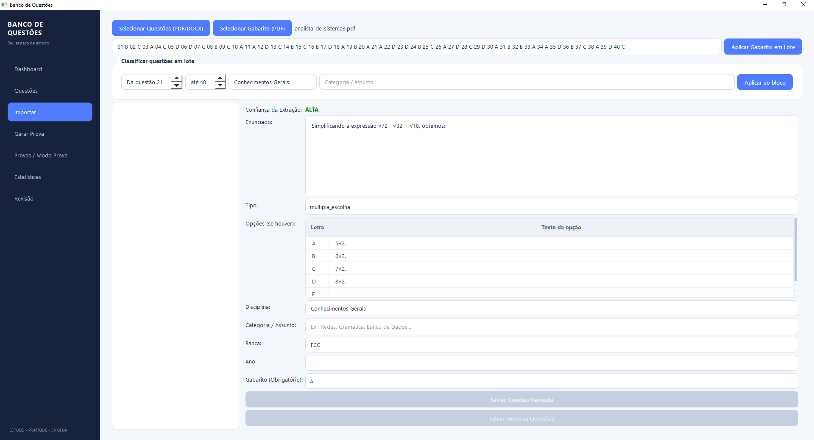
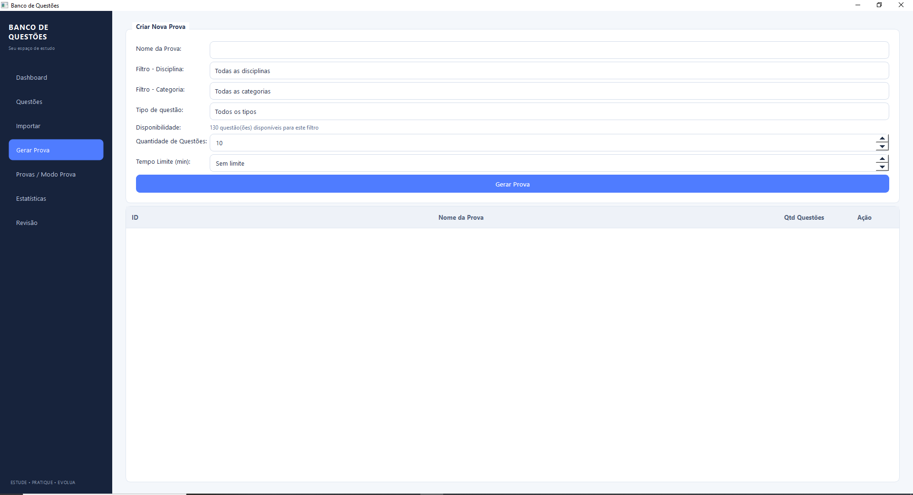
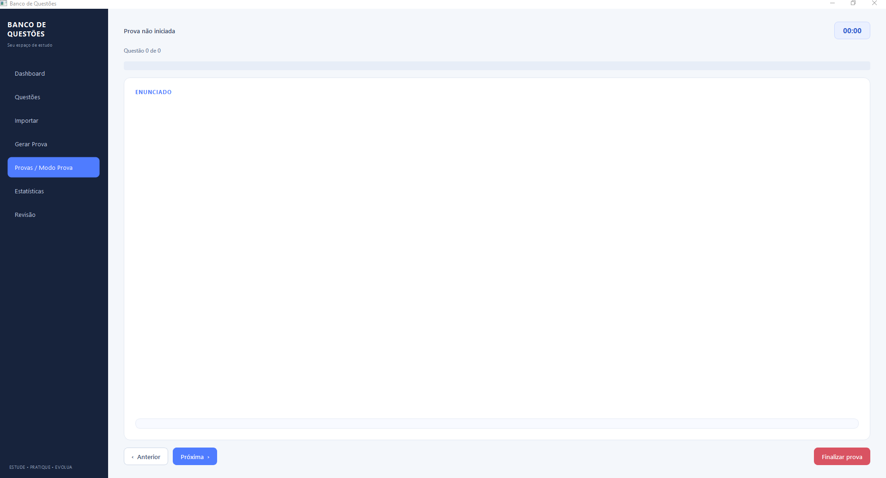
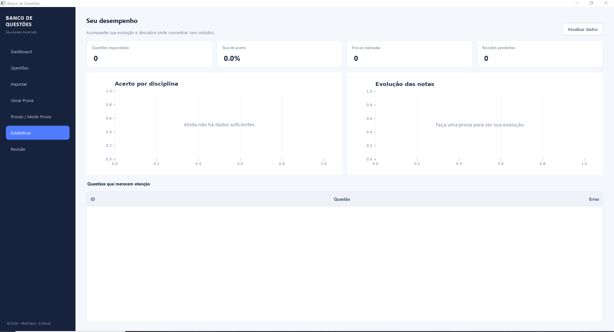
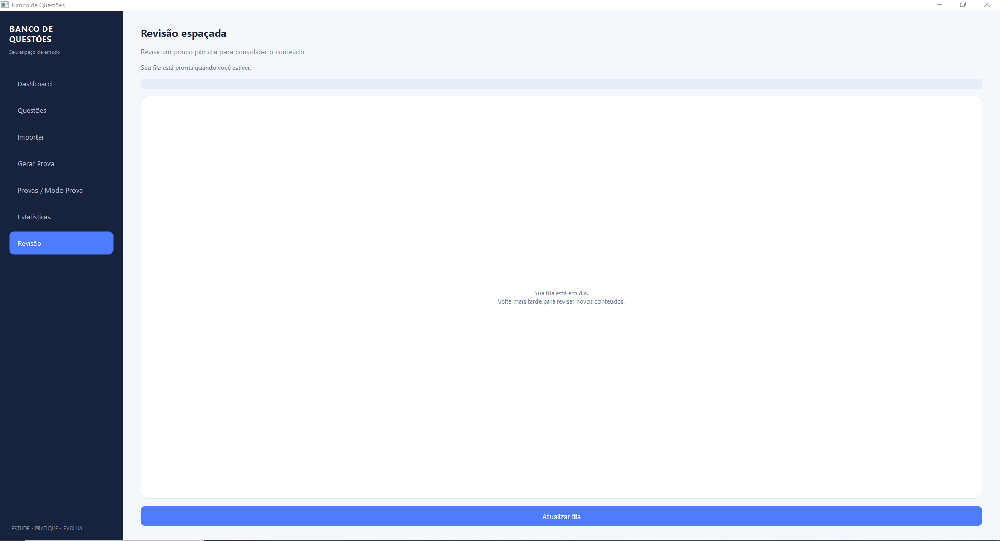

# Banco de Questões

Aplicação desktop para transformar provas de concursos em um banco de estudos organizado, pesquisável e reutilizável.

Importe uma prova, vincule o gabarito, classifique questões em lote e monte simulados personalizados por disciplina, categoria e tipo.


## Visão geral

O Banco de Questões foi pensado para reduzir o trabalho manual de quem estuda por provas anteriores:

- importa questões de PDFs e DOCX;
- reconhece enunciados e alternativas em diferentes layouts;
- importa gabaritos textuais, tabelados ou escaneados;
- permite classificar faixas inteiras de questões em lote;
- gera provas por disciplina, categoria e tipo;
- registra respostas, desempenho e revisões espaçadas;
- mantém tudo localmente em SQLite.

## Telas

### Dashboard



### Banco de questões



### Importação e classificação em lote



Durante a importação, é possível aplicar uma disciplina e uma categoria a um intervalo inteiro, por exemplo:

```text
1–15   Língua Portuguesa        Gramática
16–25  Matemática               Raciocínio lógico
26–50  Informática              Redes
```

### Geração de provas



Os filtros disponíveis são disciplina, categoria e tipo de questão — múltipla escolha ou certo/errado.

### Modo prova



### Estatísticas



### Revisão espaçada



## Fluxo recomendado

1. Abra **Importar** e selecione o PDF/DOCX da prova.
2. Selecione o PDF do gabarito, quando houver.
3. Confira os itens com confiança menor.
4. Use **Classificar questões em lote** para aplicar disciplina e categoria por faixa.
5. Clique em **Salvar Todas as Questões**.
6. Abra **Gerar Prova** e escolha os filtros desejados.
7. Resolva a prova e acompanhe sua evolução em **Estatísticas** e **Revisão**.

Se o PDF do gabarito não puder ser interpretado, cole a sequência de respostas no campo de lote:

```text
A D B C E A B D C E ...
```

> **Atenção:** PDFs de bancas diferentes podem usar estruturas, cabeçalhos, colunas e tabelas distintas. Por isso, algumas informações — como disciplina, categoria, alternativas ou gabarito — podem precisar de ajustes dependendo do arquivo. Sempre confira a prévia e valide as questões antes de salvá-las no banco.

## Instalação

Requisito: Python 3.12 ou superior.

### Windows

```powershell
git clone https://github.com/feliperjj/Banco-Questoes.git
cd Banco-Questoes
python -m venv venv
venv\Scripts\Activate.ps1
python -m pip install -r requirements.txt
python main.py
```

### Linux ou macOS

```bash
git clone https://github.com/feliperjj/Banco-Questoes.git
cd Banco-Questoes
python3 -m venv venv
source venv/bin/activate
python -m pip install -r requirements.txt
python main.py
```

O OCR usa dependências Python do próprio projeto. Não é necessário instalar um programa OCR separado no Windows.

## Estrutura do projeto

```text
.
├── main.py                    # Entrada da aplicação
├── requirements.txt           # Dependências
├── docs/screenshots/          # Imagens desta documentação
├── src/
│   ├── db/                    # Modelos e inicialização do SQLite
│   ├── importador/            # Extração, OCR e parser
│   ├── models/                # Persistência e serviços de domínio
│   └── ui/                    # Páginas, navegação e estilos
└── data/                      # Banco e logs locais
```

## Dados locais

O banco é criado automaticamente em `data/questoes.db`. Questões, respostas, provas e logs ficam locais e o diretório `data/` é ignorado pelo Git.

Isso evita publicar dados pessoais ou conteúdo de provas no GitHub. Faça backups do banco antes de operações de limpeza ou reimportação.

## Desenvolvimento

Para verificar a sintaxe:

```powershell
venv\Scripts\python.exe -m compileall -q src
```

O projeto utiliza PySide6 na interface, Peewee para persistência, SQLite como banco local e `pdfplumber`/RapidOCR no pipeline de importação.

Antes de alterar comportamento existente, consulte o [cérebro do projeto](docs/PROJECT_BRAIN.md). Ele documenta os fluxos, contratos entre camadas, invariantes do banco, estados da UI e a matriz de regressão manual.

## Licença

Este projeto ainda não possui uma licença pública definida. Consulte o autor antes de redistribuir o código ou as imagens de provas.
